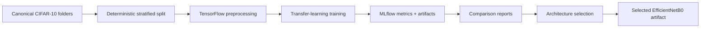
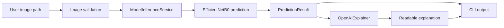
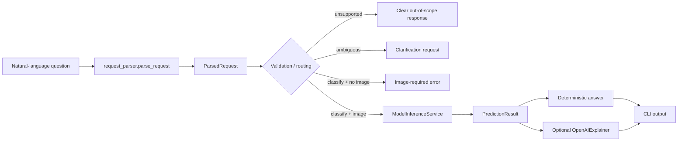
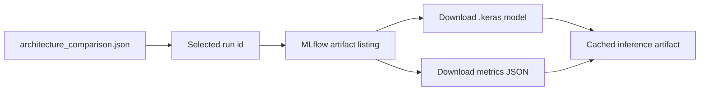

# System Architecture

## Project Direction

Decision Intelligence Engine is a CLI-based computer-vision assistant. It uses a CNN trained on CIFAR-10 for image classification and an LLM-powered explanation layer to translate predictions into clear user-facing guidance.

## Dataset Architecture Decision

- The canonical raw dataset layout is:
  - data/raw/cifar10/train/<class>/*.png
  - data/raw/cifar10/test/<class>/*.png
- The official CIFAR-10 test split remains untouched.
- Validation is derived deterministically from the training tree.
- Supporting multiple CIFAR formats is intentionally avoided to keep the pipeline simple and reproducible.

## High-Level System Overview

The system has two tightly coupled layers:

- Predictive layer: image preprocessing plus CNN inference for class probabilities.
- Interaction layer: CLI input handling plus LLM explanation generation using model outputs and confidence context.

Phase 5B keeps these layers separate in code:

- request_parser.py: deterministic natural-language request parsing into a structured ParsedRequest (no LLM involved in parsing)
- model_inference.py: artifact resolution, image validation, preprocessing, and EfficientNetB0 inference
- llm_explainer.py: prompt construction and OpenAI Responses API interaction
- ask.py: natural-language-first CLI orchestration (parse -> validate -> classify -> optional explain)
- explain_image.py: original image-first CLI orchestration only, unchanged

Current selected predictive model:

- EfficientNetB0 with ImageNet weights
- frozen backbone
- effective model input resolution 96x96
- selected after comparison against MobileNetV2 32x32 and MobileNetV2 96x96

## Mermaid Diagrams

### Training and Selection

### Inference and Explanation

### Natural-Language Request Routing

Unsupported, ambiguous, and missing-image requests terminate before any model loading and before any OpenAI request. Parsing is deterministic; the LLM never performs routing or intent extraction.

### MLflow Artifact Resolution

## User Workflow

1. User asks a natural-language question, optionally with an image path (`ask.py`), or runs the image-first CLI directly (`explain_image.py`).
2. The deterministic parser converts the request into a structured `ParsedRequest` with an intent, optional CIFAR-10 target class, and image requirement.
3. Unsupported and ambiguous requests are rejected with clear messages before any model or LLM call.
4. Valid classification requests load the selected model, validate the image, and run inference.
5. A deterministic answer is built from the prediction and confidence; target-class questions are answered with classifier semantics (predicted class and confidence, never object-detection absence claims).
6. When enabled, the LLM explains the prediction with caveats.
7. If input is invalid or out of scope, the CLI returns a clear error or a safe fallback.

## Data Flow

### Training Data Flow

1. Acquire CIFAR-10 data and document the source.
2. Split the training tree into deterministic train and validation manifests.
3. Apply training transforms and architecture-compatible preprocessing.
4. Train CNN variants and log all run metadata to MLflow.
5. Evaluate on held-out test data and persist artifacts.
6. Compare runs and freeze the best artifact for inference.

### Inference Data Flow

1. Accept a user-supplied image path.
2. Validate file type, dimensions, and decode success.
3. Apply deterministic inference transforms, including architecture-compatible resizing and preprocessing.
4. Run the selected EfficientNetB0 inference path.
5. Build explanation payload from predicted class, confidence, and top-k alternatives.
6. Generate LLM explanation and return a structured response.

Supported CIFAR-10 classes for inference and explanation:

- airplane
- automobile
- bird
- cat
- deer
- dog
- frog
- horse
- ship
- truck

## Model Training Workflow

1. Baseline CNN setup with fixed seed and reproducible split strategy.
2. Train at least 3 meaningfully different configurations.
3. Expand to at least 5 total MLflow runs with varied architecture and/or hyperparameters.
4. Track per-epoch and final metrics, including accuracy and loss plus classification reports where applicable.
5. Evaluate final candidates on held-out test data.
6. Programmatically select the best run using MLflow search/query workflow.

## Inference Workflow

1. Load the selected EfficientNetB0 model artifact from the finalized local model artifact path.
2. Preprocess the incoming image with training-compatible resizing and EfficientNetB0-compatible scaling.
3. Compute class probabilities and top-k predictions.
4. Apply confidence guardrails:
   - low confidence -> uncertainty-aware response
   - ambiguous top classes -> present alternatives
5. Send compact prediction context to the LLM.
6. Return a user-facing explanation with caveats.

Classifier-only mode:

- The CLI can skip OpenAI with --no-llm.
- This mode is used for local verification, offline testing, and environments without OPENAI_API_KEY.

## MLflow Integration Points

- Experiment setup: experiment name, run tags, dataset version metadata.
- Training runs: hyperparameters, architecture notes, transform strategy.
- Metric logging: training, validation, and test metrics plus confidence diagnostics.
- Artifact logging: trained model, label mapping, and key evaluation outputs.
- Selection: use MLflow search results to rank runs and determine the best model.

## LLM Integration Points

- Prompt input:
  - predicted class
  - confidence score
  - top-k alternatives
  - model limitations template
- Prompt goals:
  - explain the prediction in plain language
  - avoid fabricated certainty
  - include caveats for low-confidence outputs
- Output contract:
  - concise explanation
  - confidence-aware interpretation
  - optional follow-up suggestion, such as uploading a clearer image

## Error Handling Strategy

- Input validation errors:
  - unsupported file types
  - unreadable or corrupt images
  - missing upload path
- Inference errors:
  - model artifact not found
  - shape or transform mismatch
  - runtime inference exceptions
- LLM errors:
  - API timeout or rate limit
  - malformed response
  - provider unavailability
- Fallback behavior:
  - always return a deterministic prediction summary even if LLM fails
  - provide a plain, non-LLM template explanation on LLM failure
  - log errors for debugging and postmortem analysis

Phase 5B CLI behavior:

- classifier-only mode succeeds without an API key
- explanation mode returns clear user-facing errors for missing API key, API failure, timeout, or malformed response
- missing or vague questions fall back to a deterministic default prompt

## Future Scalability Considerations

- Model evolution:
  - swap CNN backbones without changing the interface contract
  - support transfer learning and model versioning
- Deployment scaling:
  - separate the inference service from the UI process
  - cache the model in memory for low-latency requests
- Observability:
  - add structured logging and inference telemetry
  - monitor confidence drift and class distribution drift
- Product growth:
  - batch inference mode
  - user feedback loop for mislabeled or uncertain cases
  - optional multimodal prompt enhancements for richer explanations

## Phase 3 Entry Criteria

- Dataset architecture standardized
- Data audit completed
- Preprocessing strategy approved
- Transfer-learning architecture selected
- TensorFlow/Keras established as the project framework
